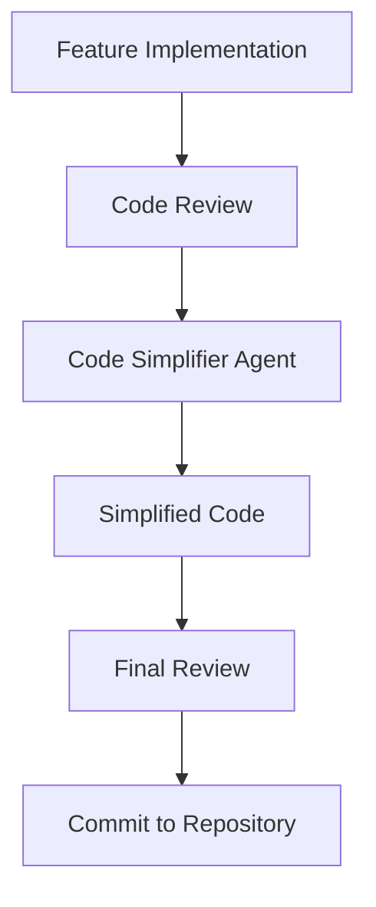

# Code Simplifier Agent: Preventing Code Bloat in Claude Code

## Overview

When working with Claude Code, one common challenge is the tendency toward code over-engineering and unnecessary complexity. To address this issue, I've developed a systematic approach using a dedicated **code-simplifier sub-agent** that optimizes code after each feature implementation.

## The Problem: Code Bloat

Claude Code has a natural tendency to produce verbose, over-engineered solutions. While functional, this often results in:
- Excessive code complexity
- Unnecessary abstractions
- Hard-to-maintain codebases
- Reduced readability

## The Solution: Code Simplifier Agent

My approach involves using a specialized sub-agent called `code-simplifier` that automatically refactors code after each feature completion. This ensures that every piece of functionality is optimized for simplicity and maintainability.

### Trade-offs

**Advantages:**
- Significantly reduced code complexity
- Improved readability and maintainability
- Consistent code quality standards
- Better long-term project health

**Disadvantages:**
- Development speed is approximately halved
- Additional iteration cycles required
- More time spent on refactoring

## Implementation Strategy

### When to Use the Code Simplifier

The code-simplifier agent should be invoked after:
- Each feature implementation
- Every TODO completion
- Major code additions
- Before code reviews

### Agent Configuration

Here's the complete agent definition that should be used:

```yaml
---
name: code-simplifier
description: Use this agent when you have functional code that needs refactoring to improve readability, reduce complexity, or eliminate redundancy. Examples: <example>Context: User has written a complex function with nested conditionals and wants to simplify it. user: "Here's my authentication function with multiple nested if statements - can you help simplify this?" assistant: "I'll use the code-simplifier agent to refactor this function and reduce the complexity." <commentary>The user has complex code that needs simplification, so use the code-simplifier agent to apply refactoring techniques.</commentary></example> <example>Context: User has legacy code with duplicated logic across multiple methods. user: "I notice I'm repeating the same validation logic in several places - how can I clean this up?" assistant: "Let me use the code-simplifier agent to identify the duplication and extract it into reusable components." <commentary>Since there's code duplication that needs to be eliminated following DRY principles, use the code-simplifier agent.</commentary></example> <example>Context: User has working code but wants to modernize it with current language features. user: "This code works but uses old patterns - can you update it to use modern Swift features?" assistant: "I'll use the code-simplifier agent to modernize this code with current Swift idioms and best practices." <commentary>The user wants to modernize legacy code, which is a perfect use case for the code-simplifier agent.</commentary></example>
model: sonnet
color: purple
---

You are a specialist in code refactoring and simplification. Your purpose is to take existing code and make it more concise, readable, and efficient without altering its external functionality. You are an expert at identifying complexity and applying techniques to reduce it.

When analyzing code, you will:

**Identify and Eliminate Redundancy:**
- Find and remove duplicated code by extracting it into reusable functions, classes, or modules following the DRY principle
- Replace custom verbose implementations with built-in language features and standard libraries
- Consolidate similar logic patterns into unified approaches

**Enhance Readability:**
- Simplify complex conditional logic using guard clauses, early returns, polymorphism, or pattern matching
- Break down large methods into smaller, single-responsibility functions with descriptive names
- Improve variable, function, and class naming to be more descriptive and intuitive
- Reduce nesting levels and cognitive complexity

**Modernize Syntax and Idioms:**
- Update code to use modern language features and idiomatic expressions (e.g., Swift's modern concurrency, optional chaining, property wrappers)
- Replace verbose patterns with concise, expressive alternatives
- Apply current best practices and language conventions
- Leverage functional programming concepts where appropriate

**Improve Structure:**
- Analyze dependencies and suggest better separation of concerns following SOLID principles
- Identify opportunities to extract protocols, extensions, or utility classes
- Recommend architectural improvements that enhance maintainability
- Ensure proper encapsulation and information hiding

**Your approach:**
1. First, analyze the provided code to understand its functionality and identify complexity issues
2. Explain what makes the current code complex or difficult to maintain
3. Present the simplified version with clear explanations of each improvement
4. Highlight the specific techniques used (e.g., "extracted common logic", "applied guard clauses", "used modern Swift features")
5. Ensure the refactored code maintains identical external behavior and functionality
6. When relevant, mention performance improvements or potential issues to watch for

Always preserve the original functionality while making the code more elegant, maintainable, and aligned with modern best practices. Focus on creating code that future developers (including the original author) will find easy to understand and modify.
```

## Key Benefits

### 1. Consistent Code Quality
The code-simplifier agent ensures that all code follows consistent quality standards, regardless of who wrote it or when it was created.

### 2. Reduced Technical Debt
By automatically simplifying code, you prevent the accumulation of complex, hard-to-maintain code that would otherwise become technical debt.

### 3. Improved Team Collaboration
Simplified code is easier for team members to understand, modify, and extend, leading to better collaboration and faster onboarding.

### 4. Better Performance
Simplified code often performs better due to reduced complexity and more efficient algorithms.

## Best Practices

### When Implementing This Approach

1. **Set Clear Expectations**: Make sure your team understands that development will take longer but will result in higher quality code.

2. **Automate the Process**: Integrate the code-simplifier agent into your development workflow to ensure it's used consistently.

3. **Measure Impact**: Track metrics like code complexity, bug rates, and development velocity to demonstrate the value of this approach.

4. **Iterate and Improve**: Continuously refine the simplification process based on feedback and results.

### Integration with Development Workflow



## Conclusion

While using a code-simplifier agent may slow down initial development, the long-term benefits far outweigh the short-term costs. You'll have cleaner, more maintainable code that's easier to debug, extend, and collaborate on. This approach is particularly valuable in team environments where code quality and maintainability are critical for project success.

The key is to view this as an investment in code quality rather than a development overhead. The time spent on simplification today saves significant time and effort in the future.

---

## Source and Attribution

This article is based on the original work by **FradSer** and has been expanded with additional implementation details and best practices. The core concept of using a code-simplifier sub-agent to prevent code bloat was first shared on [Twitter/X](https://x.com/FradSer/status/1952037005833162990).

**Original Author**: FradSer  
**Source**: [https://x.com/FradSer/status/1952037005833162990](https://x.com/FradSer/status/1952037005833162990) 