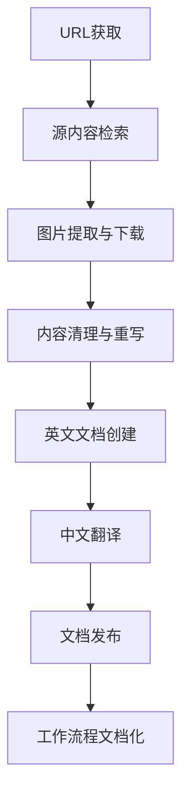

# 内容生产工作流程文档

## 概述

本文档记录了从外部URL获取内容到最终发布多语言技术文档的完整工作流程。以"Claude Code最佳实践"文档为例，展示了整个内容生产流程。

## 工作流程总览



## 详细工作流程

### 第一阶段：源内容获取

#### 1. URL获取与验证
- **输入**: 外部文章URL
- **示例**: `https://www.anthropic.com/news/claude-code-best-practices-for-agentic-coding`
- **工具**: `curl` 或浏览器获取

#### 2. 源内容检索
- **目标目录**: `content/sources/`
- **文件命名规则**: `{topic}_{date}.md`
- **示例文件**: `claude-code-best-practices-for-agentic-coding_2025-08-04.md`
- **内容格式**: 原始HTML转换为Markdown

### 第二阶段：资源处理

#### 3. 图片提取与本地化
- **扫描源文档**: 识别所有外部图片URL
- **下载目标**: `public/images/` 目录
- **文件命名**: 保持原始文件名或语义化命名
- **URL更新**: 将外部链接替换为本地路径 `/images/filename.ext`

**图片处理示例**:
```bash
# 提取的图片列表
- claude-code-tool-allowlist.png
- safe-yolo-mode.png  
- claude-give-images.png
- claude-mention-files.png
```

### 第三阶段：内容优化

#### 4. 内容清理与重写
- **移除无关内容**: 导航菜单、页脚、广告等
- **保留技术细节**: 所有代码示例、最佳实践说明
- **结构优化**: 重新组织章节结构，提高可读性
- **格式标准化**: 统一标题层级、代码块格式

#### 5. 英文文档创建
- **目标路径**: `content/docs/en/best-practices/`
- **文件格式**: `.mdx` (支持React组件)
- **Front Matter**: 包含标题、描述、语言标识
- **内容结构**: 
  ```yaml
  ---
  title: Claude Code Best Practices
  description: Best practices for effective agentic coding with Claude Code
  lang: en
  ---
  ```

### 第四阶段：多语言支持

#### 6. 中文翻译
- **目标路径**: `content/docs/zh/best-practices/`
- **翻译原则**: 
  - 保持技术术语准确性
  - 适应中文读者习惯
  - 保留代码示例不变
  - 维持原文档结构
- **质量控制**: 技术概念对照检查

### 第五阶段：发布与文档化

#### 7. 文档发布
- **目录结构**:
  ```
  content/
  ├── docs/
  │   ├── en/best-practices/
  │   │   └── claude-code-best-practices.mdx
  │   └── zh/best-practices/
  │       └── claude-code-best-practices.mdx
  ├── sources/
  │   └── claude-code-best-practices-for-agentic-coding_2025-08-04.md
  public/
  └── images/
      ├── claude-code-tool-allowlist.png
      ├── safe-yolo-mode.png
      ├── claude-give-images.png
      └── claude-mention-files.png
  ```

#### 8. 工作流程文档化
- **记录完整流程**: 创建此工作流程文档
- **工具与命令**: 记录使用的工具和关键命令
- **最佳实践**: 总结优化建议

## 使用的工具与技术

### 核心工具
- **内容获取**: `curl`, 浏览器开发者工具
- **文件操作**: Claude Code 编辑工具
- **图片处理**: `wget`, `curl` 下载
- **格式转换**: HTML到Markdown转换

### 文件格式
- **源文件**: `.md` (Markdown)
- **发布文件**: `.mdx` (MDX，支持React组件)
- **图片格式**: `.png`, `.jpg`, `.svg`

### 目录结构约定
```
project/
├── content/
│   ├── docs/          # 发布的文档
│   │   ├── en/        # 英文文档
│   │   └── zh/        # 中文文档
│   └── sources/       # 原始源材料
├── public/
│   └── images/        # 本地化图片资源
└── workflow-documentation.md  # 本文档
```

## 质量控制检查单

### 内容质量
- [ ] 所有外部图片已本地化
- [ ] 图片链接正确指向本地路径
- [ ] 技术细节完整保留
- [ ] 代码示例格式正确
- [ ] 无关内容已清理

### 多语言质量
- [ ] 中文翻译准确自然
- [ ] 技术术语翻译一致
- [ ] 代码示例保持原样
- [ ] 文档结构保持一致

### 技术规范
- [ ] Front Matter 格式正确
- [ ] 文件路径符合约定
- [ ] 图片路径使用相对路径
- [ ] MDX语法无错误

## 优化建议

### 自动化改进
1. **脚本化图片下载**: 创建自动提取和下载图片的脚本
2. **批量翻译工具**: 集成翻译API以提高效率
3. **质量检查脚本**: 自动验证链接有效性和格式正确性

### 流程优化
1. **模板化**: 为不同类型内容创建标准模板
2. **版本控制**: 使用Git跟踪所有变更
3. **内容审核**: 建立多轮审核机制

### 扩展性考虑
1. **多语言支持**: 准备添加更多语言版本
2. **内容分类**: 建立更细致的内容分类体系
3. **SEO优化**: 考虑搜索引擎优化需求

## 总结

本工作流程提供了一个完整的内容生产管道，从外部源获取到多语言发布。通过标准化流程、质量控制和持续优化，确保了高质量技术内容的高效生产。

**关键成功因素**:
- 系统化的流程管理
- 严格的质量控制
- 完整的资源本地化
- 多语言内容一致性
- 详细的文档记录

此工作流程可作为未来类似内容生产任务的标准参考，并可根据具体需求进行调整和优化。
